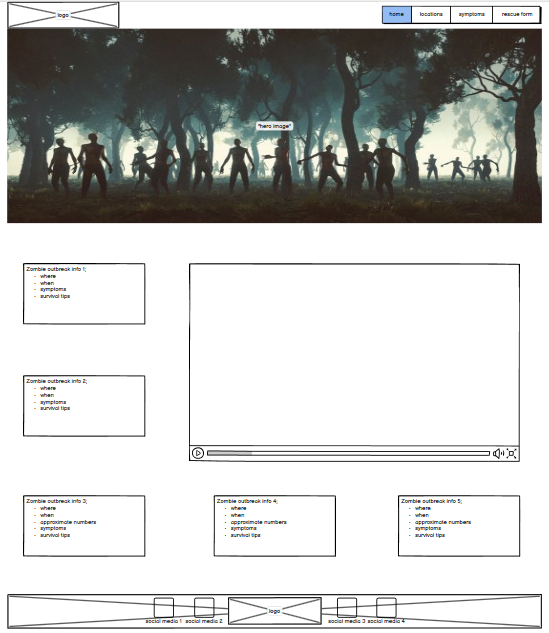

*Hello*

This project is a report based site regarding an outbreak of a "zombie virus" with the purpose of informing people about said virus.

This is how the site should have looked once finished, with a few alterations as time went by.

My main issues with this project were mostly due to images - either having difficulty regarding the size of the image or getting teh position correct on the page.

Credits:

flu-img - https://cdn3.iconfinder.com/data/icons/mers-cov-symptoms-transmission-prevention/278/MERS-CoV-virus-002-512.png

vomiting-img - https://cdn2.iconfinder.com/data/icons/medical-symptoms-1/64/vomiting-nausea-food-poisoning-illness-morning-sickness-512.png

seizure-img - https://cdn1.iconfinder.com/data/icons/children-autism-spectrum-disorder-asd/185/autism-child-children-012-1024.png

anger-img - https://cdn1.iconfinder.com/data/icons/children-autism-spectrum-disorder-asd/185/autism-child-children-012-512.png

confusion-img - https://cdn1.iconfinder.com/data/icons/children-autism-spectrum-disorder-asd/185/autism-child-children-012-512.png

bleeding-img - https://cdn3.iconfinder.com/data/icons/mers-cov-symptoms-transmission-prevention/278/MERS-CoV-virus-002-512.png

news report video & image for the link - https://www.youtube.com/watch?v=4myB_dEbiSM

font icons credit - fontawesome.com

zombie-background-3 - https://us.123rf.com/450wm/raybon/raybon1607/raybon160700139/60266522-hand-ghost-zombie-bloody-hands-background-maniac-blood-zombie-hands-zombie-theme-halloween-theme.jpg?ver=6

No copyright infringement is intended.